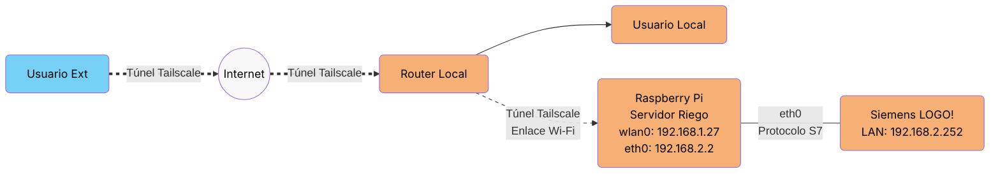

## Diagramas explicativos 
### Diagrama de red


### Decisión riego 
El servidor cada x tiempo dentro de un rango de entre 20 y 40 minutos llama a las APIs climáticas (depende de si se permite llamarlas o no, ya que cada API cuenta con un TTL personalizado). En cada llamada se consigue la información climática actualizada, con esa nueva información se determina si en ese preciso momento es necesario regar siguiendo el diagrama siguiente:

```mermaid
graph LR
    classDef default fill:#f9f8f9,rx:6px,ry:6px,color:#000000, font-family:'Inter', rx:8px,ry:8px;;
    classDef rpiDecision fill:#E8EAF6,stroke:#3F51B5,stroke-width:1.5px,color:#1A237E,font-family:'Inter';
    classDef plcDecision fill:#FFF3E0,stroke:#E65100,stroke-width:1.5px,color:#5D4037,font-family:'Inter';
    classDef rpiGraph fill:#ffa4a4,stroke:#ff0000,stroke-width:1.5px,color:#000000,font-family:'Inter', rx:18px,ry:18px;;
    classDef plcGraph fill:#2970A3,stroke:#72eeff,stroke-width:1.5px,color:#000000,font-family:'Inter', rx:18px,ry:18px;;
    classDef accion fill:#E8F5E9,stroke:#4CAF50,stroke-width:1.5px,color:#1B5E20,font-family:'Inter',rx:8px,ry:8px;
    classDef abortar fill:#FFEBEE,stroke:#F44336,stroke-width:1.5px,color:#B71C1C,font-family:'Inter',rx:8px,ry:8px;

    subgraph RPI [Raspberry Pi - Lógica en Python]
      A[Lluvia acumulada de ayer y de hoy hasta la hora actual] --> B{¿Lluvia acumulada > 5 mm?}
      B --Si--> C[No pedir regar]
      B --No--> D[Comprobar cuánto lloverá el resto del día]
      D --> E{¿Lluvia acumulada y lluvia prevista > 5 mm?}
      E --Si--> C[No pedir regar]
      E --No--> F{¿Va a llover ahora?}
      F --Si--> C[No pedir regar]
      F --No--> G[Enviar estado al PLC]
    end
    class RPI rpiGraph;

    subgraph PLC [Lógica del PLC]
      G --Protocolo S7--> H[Pedir regar]
      H --> I{¿Hora actual dentro de los periodos del temporizador semanal del PLC?}
      I --No--> J[PLC ignora la petición]
      I --Sí--> K{¿Ya se regó hoy?}
      K --No--> L[Iniciar riego]
      K --Sí--> J[PLC ignora la petición]
    end
    class PLC plcGraph;
    class B,E,F,I,K rpiDecision;
    
    linkStyle 0,1,2,3,4,5,6,7,8,9,10,11,12,13 stroke:#000000
```


Como se puede ver, al ejecutarse el algoritmo en cada llamada a las APIs, la decisión puede ir variando a lo largo del día.

- Ejemplo de salida en consola:
  ```bash
        Comprobando si hace falta regar:
        2026-06-09 00:00:00-23:59:59: 0.0 mm
        2026-06-10 00:00:00-21:29:24: 0.0 mm
        No llovió lo suficiente. ¿Se alcanzará a lo largo del día?
        Parece que va a hacer falta regar: 0.0mm
        ¿Hace falta regar? True
  ```
  En este ejemplo, aunque el servidor diga que es necesario regar, el PLC ignorará la petición porque ya habría regado poco después del amanecer. Pero si fuese un día en el que estuviese lloviendo todo el día hasta ese momento, aún no se alcanzasen los 5mm que necesita el césped al día y en el momento de ejecución no estuviese lloviendo, se regaría siempre y cuando el PLC lo permita (que sea horario de verano y no sea de noche).

> #### ¿Qué ocurre si el servidor está caído?
Si hay algún problema de comunicación entre el servidor y el PLC, entra en modo emergencia y regaría en el primer momento del día que se cumplan las condiciones configuradas en su lógica interna, una vez comenzase a regar se detendría el riego hasta el próximo día configurado.

> #### ¿Qué ocurre si el servidor está funcionando pero las APIs están caídas?
Por defecto la lluvia acumulada es 0.0mm por lo que se comportaría igual que si el servidor estuviese caído.

**Nota:** Estos dos escenarios plantean un inconveniente. Este es que, al no tener sensores físicos, regaría aunque estuviese lloviendo, desperdiciando agua innecesariamente. Por lo que siempre que sea posible es mejor instalar algún sensor de humedad local. O en su defecto, se podría modificar el algoritmo para que sólo riegue si el servidor está operativo. El inconveniente de esta solución es que el césped podría secarse.
